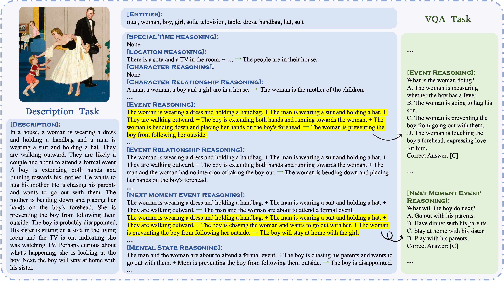

<p align="center">
  
</p>

# A Cognitive Evaluation Benchmark of Image Reasoning and Description for Large Vision-Language Models

## News

🔥 **2024-06-09**: We released CogBench! Hope you find it useful and interesting!

## Introduction

Inspired by the prevalent use of the "Cookie Theft" picture description task in human cognition test, 
CogBench is proposed to evaluate high-level cognitive abilities of LVLMs using images with rich semantics.

<p align="center">
  
</p>

CogBench defines **eight reasoning capabilities** and consists of an **Image Description task** and a **Visual Question Answering task**. 

The eight reasoning abilities include Special Time Reasoning, Location Reasoning, Character Reasoning, Character Relationship Reasoning, Event Reasoning, Event Relationship Reasoning, Next Moment Event Reasoning, and Mental State Reasoning.

For the Description task,  [Entities], [Chain-of-Reasonings (CoRs)] and [Description] are annotatated. [Entities] and [CoRs] are used to evaluate the low-level recognition ability and high-level cognitive reasoning abilities of models respectively based on their description. Evaluation metrics for both levels are calculated using recall scores, referred to as **Recognition Score** and **Cognition Score**, respectively.

The VQA task features standard four-option Multiple-Choice Questions. The evaluation metric for this task is accuracy.

<p align="center">
  
</p>

## Data

### Images in CogBench
Images in CogBench are carefully collected and they feature i) a prominent story theme, ii) richer content, iii) display complex relationships among entities, and thus require stronger cognitive abilities to understand and
describe.

<p align="center">
  
</p>

### Statistics
Currently, CogBench consists of 251 semantically-rich images with a total of 2670 entities, 2245 CoRs, 251 descriptions and 2577 questions, showcased in Table 1. 

**Table 1: Distribution of CoRs and questions in CogBench**
|                       | **Time** | **Location** | **Character** | **Character**<br>**Relationship** | **Event** | **Event**<br>**Relationship** | **Next Moment**<br>**Event** | **Mental State** |
|-----------------------|----------|--------------|---------------|----------------------------------|-----------|-------------------------------|-----------------------------|------------------|
| **CoR**               | 47       | 179          | 106           | 263                              | 701       | 425                           | 107                         | 417              |
| **QA**                | 86       | 220          | 162           | 317                              | 658       | 402                           | 135                         | 597              |


### Data Access 

To get access to the data, you must **[Sign a Data Use Agreement (DUA)](https://docs.google.com/document/d/1Q9U-GqICkollhzCCK-rHEShqyk3C4ahS/edit?usp=sharing&ouid=111415446863054830984&rtpof=true&sd=true)**.
Please read the DUA carefully, and send an email to xiujiesong@sjtu.edu.cn with the message: "I consent to the Data Usage Agreement (DUA)." and attach the DUA including your handwritten signature in it.

After obtaining the password, you can download our dataset from [Google Drive](https://docs.google.com/forms/d/e/1FAIpQLSeY-ChRRCPpXgm42FKXYsUrFXdf7d3ruCDilx1N_qIv-YpvYQ/viewform?usp=sf_link).

## Evaluate your model on CogBench

### Image Description Task

**Step 0**: Infer your model on CogBench and save your model outputs in a jsonl file like this.

```json
{"filename": "example1.jpg", "model_output": "There are three girls sitting on a bench talking together..."}
{"filename": "example2.jpg", "model_output": "In a kitchen, a girl and her mother are putting cookies into the oven..."}
...
```

#### Recognition Score
**Step 1**: Calculate Recognition Score.
```bash
python eval/recognition_score.py --cogbench_description_file_path "/path/to/cogbench_description_file.json" --model_output_file_path "/path/to/model_output_file.jsonl"
```

#### Cognition Score

**Step 1**: GPT-based evaluation.
```bash
python eval/cognition_gpt_eval.py --cogbench_description_file_path "/path/to/cogbench_description_file.json"  --model_output_file_path "/path/to/model_output_file.jsonl"  --eval_output_file_path "/path/to/eval_output_file.jsonl"  --gpt_name  "gpt-4-turbo"  --openai_api_key "your-openai-api-key"
```

**Step 2**: Calculate Cognition Score.
```bash
python eval/cognition_score.py  --eval_output_file_path "/path/to/eval_output_file.jsonl"
```

### VQA Task

**Step 0**: Infer your model on CogBench and save your model outputs in a jsonl file like this.

```json
{"question": "What is the boy's emotion?", "choice_a": "Sad.", "choice_b": "Angry.", "choice_c": "Scared.", "choice_d": "Happy.", "answer": "D", "img_id": "example1", "category": "mental", "response": "D. Happy."}
{"question": "What is the setting of the activity in the image?", "choice_a": "In a restaurant.", "choice_b": "At a bakery shop.", "choice_c": "In a school cafeteria.", "choice_d": "In the kitchen.", "answer": "D", "img_id": "example2", "category": "location", "response": "D. In the kitchen."}
...
```
Note that you need to ensure that the first character of "response" is the option (A/B/C/D) your model chose.

**Step 1**: Calculate accuracy.
```bash
python eval/vqa_accuracy.py  --model_output_file_path "/path/to/model_output_file.jsonl"
```

## Contact

Xiujie Song: xiujiesong@sjtu.edu.cn

## Acknowledgements

The construction of this repository refers to some content in [MM-VET](https://github.com/yuweihao/MM-Vet).

## Citation
If you find our work interesting, please feel free to cite our paper:

```
@article{song2024cognitive,
  title={A Cognitive Evaluation Benchmark of Image Reasoning and Description for Large Vision Language Models},
  author={Song, Xiujie and Wu, Mengyue and Zhu, Kenny Q and Zhang, Chunhao and Chen, Yanyi},
  journal={arXiv preprint arXiv:2402.18409},
  year={2024}
}
```
